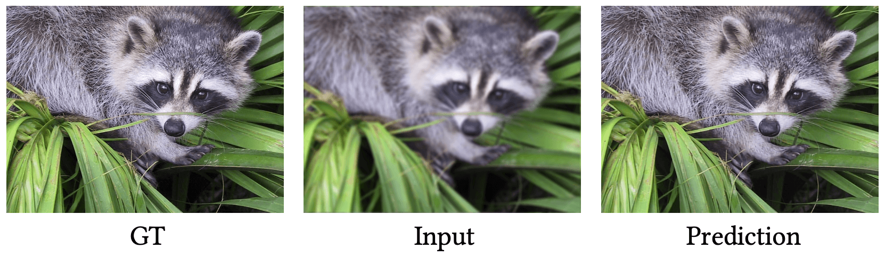

<p align="center">
<a href="https://light.princeton.edu/publication/delta_prox/">
    
<!--      -->
    </a> &ensp; 
</p>


<p align="center">
Differentiable Proximal Algorithm Modeling for Large-Scale Optimization
</p>

<p align="center">
<!-- <a href="">Project Page</a> | -->
<a href="#">Paper</a> |
<a href="https://deltaprox.readthedocs.io/">Docs</a> |
<a href="https://github.com/Zeqiang-Lai/DeltaProx/tree/master/tutorials">Tutorials</a> |
<a href="https://github.com/Zeqiang-Lai/DeltaProx/tree/master/examples">Examples</a> |
<a href="https://github.com/Zeqiang-Lai/DeltaProx#citation">Citation</a> 
</p>

<p align="center">
    <a href="[https://pypi.org/project/dprox/](https://pypi.org/project/dprox/)">
        
    </a>
    <a href="[https://pypi.org/project/auto-gptq/](https://arxiv.org/abs/2207.02849)">
        
    </a>
</p>

<!-- <a href="https://pypi.org/project/dprox/"></a> -->
<!-- <a href="https://arxiv.org/abs/2207.02849"></a> -->


> $\nabla$-Prox is a domain-specific language (DSL) and compiler that transforms optimization problems into differentiable proximal solvers. Departing from handwriting these solvers and differentiating via autograd, $\nabla$-Prox requires only a few lines of code to define a solver that can be *specialized based on user requirements w.r.t memory constraints or training budget* by optimized algorithm unrolling, deep equilibrium learning, and deep reinforcement learning. $\nabla$-Prox makes it easier to prototype different learning-based bi-level optimization problems for a diverse range of applications. We compare our framework against existing methods with naive implementations. $\nabla$-Prox is significantly more compact in terms of lines of code and compares favorably in memory consumption in applications across domains.

## News


- **Jun 2023** :  Release preview code.
- **May 2023** : 🎉 $\nabla$-Prox is accepted by the journal track of SIGGRAPH 2023.

## Installtion

We recommend installing 🍕 $\nabla$-Prox in a virtual environment from PyPi or Conda.

```bash
pip install dprox
```

Please refer to the [Installtion]() guide for other options.

## Quickstart

Consider a simple image deconvlution problem, where we seek to find a clean image $x$ given the blurred observation $y$ that minimizes the following objective function:

$$
\arg \min_x { \frac{1}{2} |Dx - y|^2_2 + g(x) }
$$

where $g(x)$ denotes an implicit plug-and-play denoiser prior. We could solve this problem in ∇-Prox with the following code: 

```python
from dprox import *
from dprox.utils import *
from dprox.utils.examples import *

img = sample()
psf = point_spread_function(15, 5)
b = blurring(img, psf)

x = Variable()
data_term = sum_squares(conv(x, psf) - b)
reg_term = deep_prior(x, denoiser='ffdnet_color')
prob = Problem(data_term + reg_term)

out = prob.solve(method='admm', x0=b)
```

Here is what we got,



Please refer to the [documentation]() site for more instructions on the efficient differentiation of proximal algorithm with ∇-Prox.

## Citation

```bibtex
@article{deltaprox2023,
  title={∇-Prox: Differentiable Proximal Algorithm Modeling for Large-Scale Optimization},
  author={Lai, Zeqiang and Wei, Kaixuan and Fu, Ying and Härtel, Philipp and Heide, Felix},
  journal={ACM Transactions on Graphics},
  year={2023},
}
```

## Acknowledgement

[ProxImaL](https://github.com/comp-imaging/ProxImaL) &ensp; [ODL](https://github.com/odlgroup/odl) &ensp; [DPIR](https://github.com/cszn/DPIR) &ensp; [DPHSIR](https://github.com/Zeqiang-Lai/DPHSIR) &ensp; [DGUNet](https://github.com/MC-E/Deep-Generalized-Unfolding-Networks-for-Image-Restoration)
