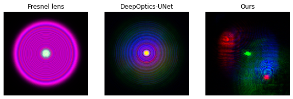
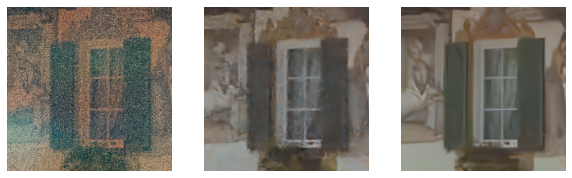

# Quicktour

```{toctree}
:hidden:

quicktour
install
```

Consider a simple image deconvlution problem, where we seek to find a clean image $x$ given the blurred observation $y$ that minimizes the following objective function:

$$
\arg \min_x { \frac{1}{2} |Dx - y|^2_2 + g(x) }
$$

where $g(x)$ denotes an implicit plug-and-play denoiser prior. 

### Solver Compliation

We could solve this problem in ∇-Prox with the following code: 

```python
from dprox import *
from dprox.utils import *
from dprox.utils.examples import *

img = sample()
psf = point_spread_function(15, 5)
b = blurring(img, psf)

x = Variable()
data_term = sum_squares(conv(x, psf) - b)
reg_term = deep_prior(x, denoiser='ffdnet_color')
prob = Problem(data_term + reg_term)

out = prob.solve(method='admm', x0=b)
```

Here is what we got,


### Solver Specialization

Conventional imaging systems employ compound refractive lens systems that are typically hand-engineered for image quality in isolation of the downstream camera task. Departing from this design paradigm, a growing body of work in computational photography [Haim et al. 2018; Horstmeyer et al. 2017] has explored the design of specialized lens system with diffractive optical elements (DOEs). 


As a specific example, we consider end-to-end computational optics that jointly optimize a diffractive optical element (DOE) and an image reconstruction algorithm,  where the observation $y$ is obtained by convolving a clear image $x$ by the point spread function (PSF) of DOE as,

$$
    y =  D\left(x;\, \theta_{DOE} \right) + \epsilon, 
$$

where  $D(\cdot; \theta_{DOE})$ indicates a shift-invariant convolution process with an optical kernel, i.e., PSF, derived from a DOE image formation model parameterized by $\theta_{DOE}$, and $\epsilon$ is measurement noise, e.g., Poissionian-Gaussian noise. 
To reconstruct target image $x$ from noise-contaminated measurements $y$, we minimize the sum of a data-fidelity $f$ and regularizer term $r$ as

$$
    min_{x \in R^n} ~ f \left( D\left(x;\, \theta_{DOE} \right) \right) + r \left(x ; \, \theta_r \right).
$$

```python
# generate input
gt = gt.to(device).float()
psf = rgb_collim_model.get_psf()
inp = img_psf_conv(gt, psf, circular=True)
inp_dprox = inp + torch.randn(*inp.shape, device=inp.device) * sigma

# build solver
x = Variable()
y = Placeholder()
PSF = Placeholder()
data_term = sum_squares(conv_doe(x, PSF, circular=True), y)
reg_term = deep_prior(x, denoiser='ffdnet_color')
solver = compile(data_term + reg_term, method='admm')

# solve the problem
y.value = inp_dprox
PSF.value = psf
with torch.no_grad():
    out_dprox = solver.solve(x0=inp_dprox,
                        rhos=rgb_collim_model.rhos,
                        lams={reg_term: rgb_collim_model.sigmas},
                        max_iter=max_iter)

```


</br>



Please refer to the [documentation]() site for more instructions on the efficient differentiation of proximal algorithm with ∇-Prox.
